# Agent design v0.1

> Status: research-stage design. The agent recommends a next action; it does not predict an interview, offer, or a candidate's worth.

## Problem

A job seeker must decide whether to apply for a particular job while important facts are incomplete. The posting may omit pay, work conditions, eligibility details, or whether the role remains active. The candidate may have incomplete evidence about their fit. The agent therefore chooses the most useful next action: **apply**, **research**, **request human help**, or **skip**.

## Input

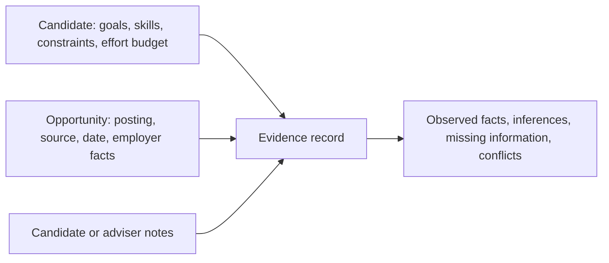

Each material claim records its source, date, whether it was observed or inferred, relevance, reliability note, and consent scope.

## Hidden state

Some decision-relevant facts cannot be observed at the time of the recommendation.

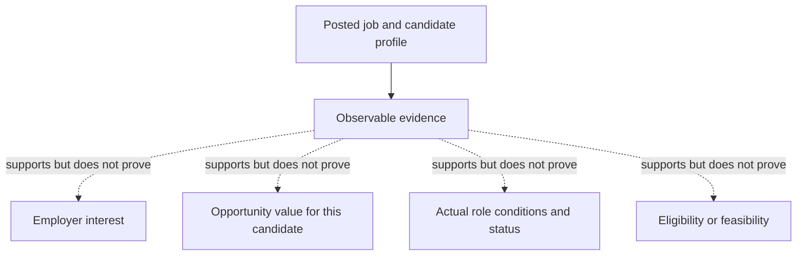

The agent must label these as uncertain rather than converting them into facts.

## Belief

Beliefs are source-aware summaries of the available evidence, not opaque predictions.

| Belief area | Possible state | Decision use |
| --- | --- | --- |
| Alignment | supported, mixed, unknown | Determines whether the role appears to serve stated goals. |
| Feasibility | confirmed, unconfirmed, conflicting | Identifies candidate-defined hard constraints. |
| Opportunity value | supported, uncertain, conflicting | Shows whether material role qualities remain unknown. |
| Employer response | unknown, weakly supported | Never presented as a guaranteed outcome. |
| Evidence quality | direct, current, attributable, weak | Determines how much confidence is appropriate. |

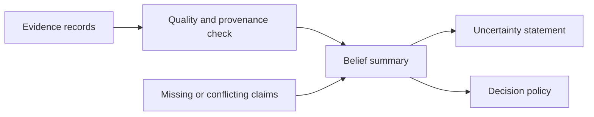

## Action

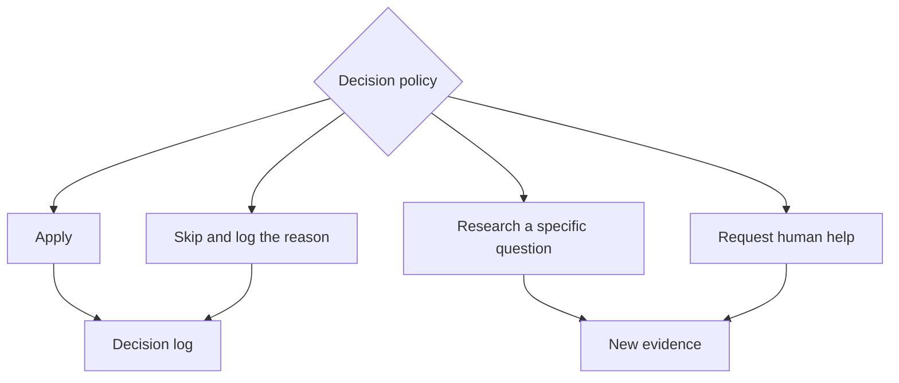

- **Apply:** feasibility and value look sufficient relative to effort; uncertainty is tolerable to the candidate.
- **Research:** a focused answer could materially change the action.
- **Request human help:** the case is high-stakes, conflicting, or needs context the agent cannot interpret safely.
- **Skip:** a verified candidate-defined constraint conflicts with the role, or value is too low for the cost.

## Cost

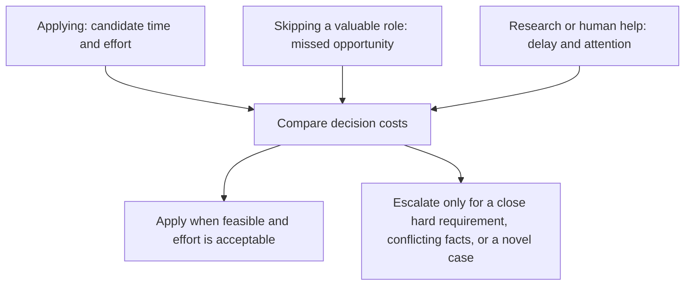

The cost model does not treat every wrong decision equally. A low-effort application can be less costly than skipping a role the candidate would have valued, but applying is not free: tailoring, assessments, deadline pressure, privacy exposure, and emotional load still matter. The candidate defines what an acceptable application cost is.

## Policy

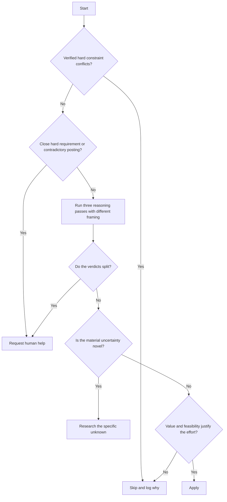

The policy uses disagreement between independent reasoning passes as an escalation signal instead of a single confidence score. It also escalates close or contradictory job requirements and genuinely novel cases. A familiar uncertainty that has repeatedly been resolved successfully is not escalated solely because confidence dips.

## Feedback

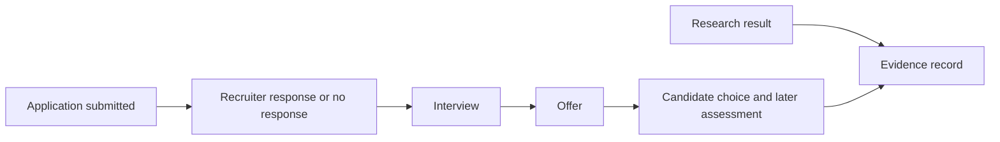

Non-response is ambiguous, not an automatic rejection. Each event answers a different question and must not be collapsed into one success label.

## Human reasoning function

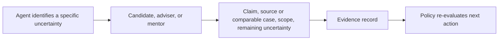

Human input is evidence with scope and limitations, not ground truth. The human reviewer should state the claim assessed, relevant context, source or comparable case, remaining uncertainty, and recommended next action.

## Core agent loop

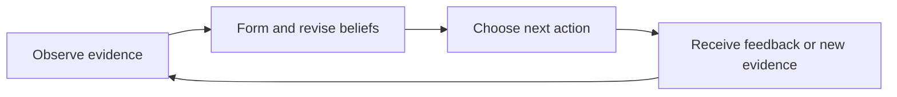

## Agent architecture

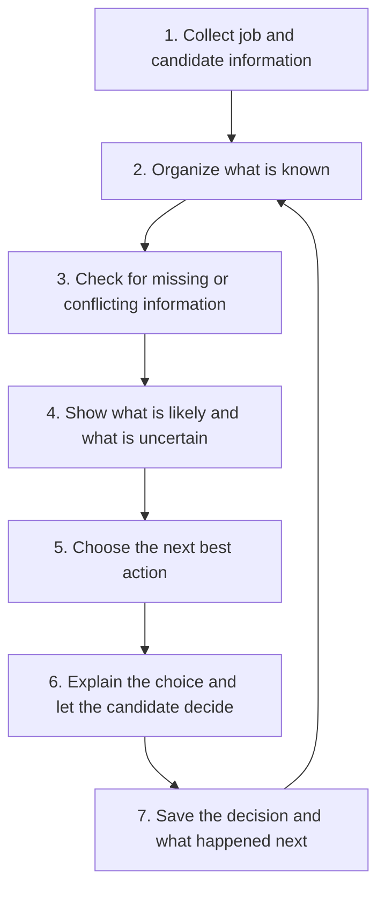

In simple terms, the agent first gathers information about the candidate and the job. It then separates known facts from missing or conflicting details. Based on that, it recommends whether to apply, do more research, ask a person for help, or skip. The candidate can always disagree with the recommendation. New information is saved and used to improve the next decision.

## Relationship between core components

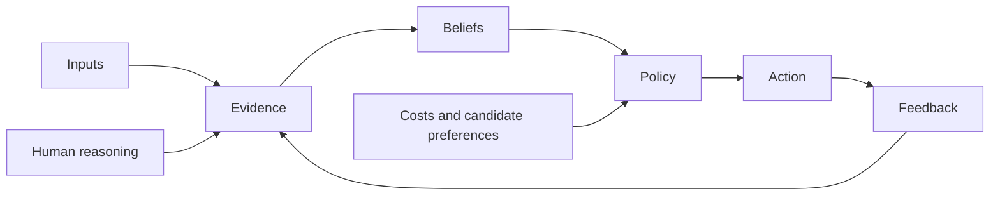

## Current design summary

| Component | Current design |
| --- | --- |
| Decision unit | One candidate considering one opportunity at one point in time. |
| Inputs | Candidate goals and constraints, opportunity details, attributed evidence, and effort budget. |
| Uncertainty | Explicit qualitative states rather than uncalibrated probabilities. |
| Actions | Apply, research, request human help, or skip. |
| Explanation | Supporting evidence, unknowns, conflicts, action cost, and candidate override. |
| Feedback | Separate research, application, recruiter, interview, offer, and candidate-assessment events. |
| Safeguards | Candidate control, privacy scope, no protected-attribute inference, and no automatic submission. |

## Design status

The decision model and diagrams are complete as a conceptual baseline. Thresholds, value trade-offs, research costs, data sources, evaluation metrics, and any probability estimates remain hypotheses that require research, testing, and appropriate legal, privacy, and fairness review.
