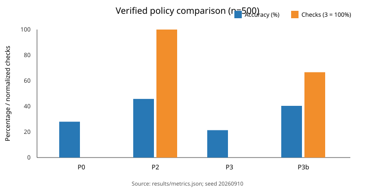

# Week 2 Results

The local simulation sampled 500 hidden states from the frozen priors with seed `20260910`, then sampled all three evidence outcomes from the corresponding likelihood rows. Every policy received the same cases. No LLM or external service was used.

| Policy | Accuracy | Decision cost | Information cost | Total cost | Avg. checks | Human rate |
|---|---:|---:|---:|---:|---:|---:|
| P0 most-common/no evidence | 0.280 | 36000.0 | 0.0 | 36000.0 | 0.00 | 0.000 |
| P2 belief + expected cost | 0.458 | 633.0 | 1127.5 | 1760.5 | 3.00 | 0.584 |
| P3 active VOI + stop | 0.214 | 786.0 | 0.0 | 786.0 | 0.00 | 1.000 |
| P3b failure-driven redesign | 0.404 | 1775.0 | 327.5 | 2102.5 | 2.00 | 0.000 |

Headline: P2 achieved the highest decision accuracy (45.8%), while frozen P3 achieved the lowest total modeled cost (786) only by escalating every case. That apparent cost win is operationally unacceptable and reveals a misspecified human-help cost. P3b removes blanket escalation and uses two checks on average, but its 40.4% accuracy and total cost 2102.5 do not dominate P2. The honest conclusion is that the redesign fixed one failure mode without producing a universally superior policy.

Action-level precision and recall, confusion matrices, and full-precision totals are in `metrics.json`. Calibration is intentionally not claimed: `confidence` is the largest action probability, but no calibration protocol was frozen before outcomes.

## Sensitivity and transfer

`sensitivity.json` contains executable stress tests. Multiplying all false-Skip losses by 100 makes P3 avoid Skip and stop without evidence; multiplying evidence costs by 10 also suppresses acquisition. Replacing the policy prior by a uniform prior while holding the seeded cases fixed changes both evidence use and decisions. Thus the recommendation is not robust to arbitrary costs or badly specified priors.

For a meaningfully different environment—software incident triage—the states would be confirmed outage, transient degradation, client-side fault, planned maintenance, security-sensitive anomaly, and other. Actions become mitigate, investigate, route to security/human help, or close. The Bayes and value-of-information machinery transfers, but the likelihoods and losses do not; using the job-domain values would be unjustified.
